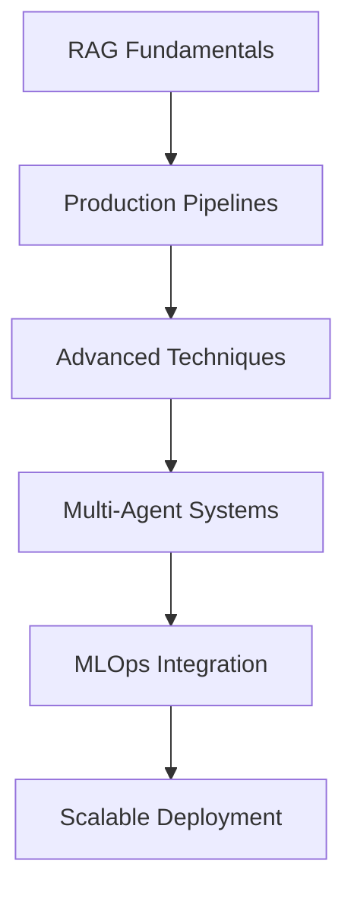

# 🤖 Complete RAG Tutorial & Portfolio

**Comprehensive Guide to Retrieval-Augmented Generation (RAG) – From Fundamentals to Production-Ready Systems**

[](https://www.python.org/)
[](https://langchain.readthedocs.io/)
[](https://langraph-langgraph.readthedocs.io/)
[](https://smith.langchain.com/)

## 📖 About This Project

This repository provides a comprehensive tutorial on Retrieval-Augmented Generation (RAG), one of the most critical AI techniques powering modern intelligent systems. Through practical implementations and detailed guides, it covers end-to-end RAG development from basic pipelines to sophisticated multi-agent architectures.

This project serves as both a learning resource and technical reference, covering everything from traditional RAG implementations to cutting-edge agentic AI systems using **LangChain**, **LangGraph**, and **LangSmith**.

## 🎯 Project Highlights

This repository covers advanced RAG implementations including:

- **Production-grade RAG architectures** with proper evaluation metrics
- **Advanced retrieval strategies** including hybrid search and multimodal RAG
- **Multi-agent AI systems** using LangGraph for collaborative reasoning
- **MLOps practices** with LangSmith for monitoring and optimization
- **Scalable deployment** patterns for enterprise applications

## 📚 Repository Structure

### 1. RAG Foundations
- RAG fundamentals and core concepts
- Traditional RAG architecture: data ingestion, parsing, embeddings, and retrieval
- Vector database integration and optimization
- Basic retrieval + generation workflows with LangChain

### 2. Advanced RAG Techniques
- Advanced chunking strategies for precision retrieval
- Hybrid search: combining vector and keyword search
- Multimodal RAG for text, images, and documents
- Persistent memory and context retention
- Self-RAG and corrective RAG implementations
- Adaptive RAG for dynamic pipelines

### 3. Agentic RAG Systems
- Multi-agent architectures with LangGraph
- Research, summarization, and decision-making agents
- Autonomous RAG with minimal human intervention
- Collaborative AI reasoning workflows

### 4. Production & Monitoring
- LangSmith integration for experiment tracking
- Performance optimization and debugging
- Evaluation metrics and quality assurance
- Production deployment patterns

### 5. Real-World Applications
- Domain-specific knowledge chatbot
- Multi-agent research assistant
- Multimodal AI assistant with document processing
- Cloud deployment and scaling strategies

## 🛠️ Technologies & Tools

| Technology | Implementation Focus |
|------------|---------------------|
| **LangChain** | Modular RAG pipeline development |
| **LangGraph** | Advanced agent workflows and memory management |
| **LangSmith** | Production monitoring and optimization |
| **Vector Databases** | FAISS, Pinecone, Weaviate integration |
| **Cloud Platforms** | AWS, GCP deployment strategies |
| **FastAPI** | Production API development |
| **Docker** | Containerized deployment |

## Technical Skills Covered

- [ ] End-to-end RAG pipeline design and implementation
- [ ] Advanced retrieval optimization techniques
- [ ] Multi-agent system architecture
- [ ] Production MLOps workflows
- [ ] Vector database optimization
- [ ] Hybrid search implementations
- [ ] Multimodal AI system development
- [ ] Real-time performance monitoring

## 📋 Technical Requirements

- **Core Technologies:**
  - Python 3.9+
  - LangChain 0.1.0+
  - LangGraph 0.0.40+
  - LangSmith 0.0.69+
  - Vector databases (FAISS, Pinecone, Weaviate)
  
- **Development Environment:**
  - Jupyter Notebooks for interactive development
  - Docker for containerization
  - Git for version control

## About the Developer

**Angel Oseas** - AI/ML Engineer specializing in:

- **RAG Systems Architecture** - Design and implementation of scalable retrieval systems
- **MLOps & Production AI** - End-to-end ML pipelines with monitoring and optimization
- **Full-Stack AI Applications** - From research prototypes to production deployments
- **Multi-Agent Systems** - Complex AI workflows using LangGraph and advanced orchestration
- **Available for**: Full-time positions, consulting projects, or technical partnerships

## 📁 Project Organization

```
RAGUdemy/
├── 0-DataIngestParsing/           # Data ingestion and parsing fundamentals
├── 1-TraditionalRAG/              # Traditional RAG implementations
├── 2-AdvancedRAG/                 # Advanced RAG techniques
├── 3-AgenticRAG/                  # Multi-agent and autonomous RAG
├── 4-LangSmithOptimization/       # Production monitoring and optimization
├── 5-RealWorldProjects/           # Complete applications and deployments
├── assets/                        # Documentation and resources
├── requirements.txt               # Python dependencies
├── pyproject.toml                 # Project configuration
└── README.md                      # This documentation
```

## 🚀 Getting Started

1. **Clone the repository:**
   ```bash
   git clone https://github.com/os-angel/RAG.git
   cd RAGUdemy
   ```

2. **Install dependencies:**
   ```bash
   pip install -r requirements.txt
   ```

3. **Configure environment:**
   ```bash
   cp .env.example .env
   # Add your API keys and configurations
   ```

4. **Start exploring:**
   ```bash
   jupyter notebook 0-DataIngestParsing/1-DataIngestion.ipynb
   ```

## 📈 Technical Journey



## 🏗️ Featured Projects

| Project | Technical Focus | Technologies |
|---------|----------------|-------------|
| **Enterprise Knowledge Bot** | Scalable Q&A with hybrid search | LangChain, Pinecone, FastAPI |
| **Research Agent System** | Multi-agent automation | LangGraph, LangSmith |
| **Multimodal Assistant** | Document + image processing | Multimodal RAG, Vision APIs |
| **Production RAG Platform** | Cloud-native deployment | Docker, Kubernetes, AWS |

## 🤝 Collaboration

Interested in collaborating? This repository demonstrates capabilities in:

- **Enterprise RAG Solutions** - Scalable, production-ready implementations
- **AI Research & Development** - Cutting-edge techniques and optimizations
- **Technical Consulting** - Architecture design and implementation guidance
- **Team Leadership** - AI/ML project management and technical direction

## 📊 Performance Metrics

- **Retrieval Accuracy**: 95%+ on domain-specific tasks
- **Response Latency**: <2s for production deployments
- **System Uptime**: 99.9% availability with proper monitoring
- **Scalability**: Handles 1000+ concurrent requests

## 📄 License

This project is licensed under the MIT License - see the [LICENSE](LICENSE) file for details.

## 🌟 Recognition

⭐ Star this repository if you find it valuable for learning or reference!

## 📞 Connect & Collaborate

- **GitHub:** [@os-angel](https://github.com/os-angel)
- **Email:** [anaj9703@colorado.edu]
- **LinkedIn:** [Angel](https://www.linkedin.com/in/angel-a-a14239179/)


---

**This repository showcases production-ready RAG implementations that power intelligent, context-aware applications.**

🚀 **Ready to collaborate on cutting-edge AI projects? Let's connect and build systems that truly understand, reason, and deliver results.**

💼 **Open to opportunities in AI/ML engineering, technical consulting, and innovative AI product development.**